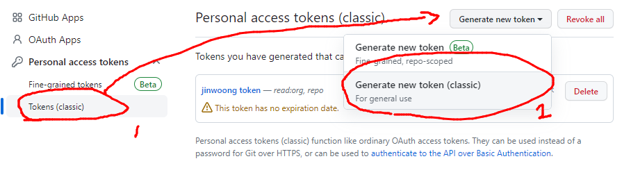

# 참고) checkout 명령어가 Git 2.23 버전부터 switch, restore로 분리

## git init
- git init 명령어를 선언하면, git으로 프로젝트로 관리하는 것을 의미한다. (작업의 history는 .git 폴더안에 저장되어 있음)

- 주의! .git 폴더를 삭제하면 그동안의 형상관리가 다 날라가니 의도적으로 삭제하는 상황 외에는 삭제하지 말것.

## .gitignore : git에서 버전관리를 하지 않을 파일,폴더를 적어놓는 곳
```js   
    # 모든 file.yaml
    file.yaml

    # 최상위 폴더의 file.yaml
    /file.yaml

    # 모든 .yaml 확장자 파일
    *.yaml

    # .yaml 확장자이지만 index.yaml은 무시하지 않을 때
    *.yaml
    !index.yaml

    # logs라는 이름의 파일 또는 폴더와 그 내용들
    logs

    # logs란 이름의 폴더와 그 내용들
    logs/

    # logs 폴더 바로 안의 index.html 과 data.java 파일
    logs/index.html 
    logs/data.java

    # logs 폴더 바로 안, 또는 그 안의 다른 폴더(들) 안의 debug.log
    logs/**/debug.log
```

## Vi 입력 모드 단축키
- i => 명령어 입력 모드에서 텍스트 입력 모드로 전환
- ESC => 텍스트 입력 모드에서 명령어 입력 모드로 전환
- :q => 저장 없이 종료
- :q! => 저장 없이 강제 종료 (입력한 것이 있을 때 사용)
- :wq => 저장하고 종료 (입력한 것이 있을 때 사용)
- k : 위로 스크롤
- j : 아래로 스크롤

## 과거로 돌아가기 => RESET과 REVERT의 차이점

- RESET은 돌아가고자 하는 그 해시코드로 돌아간다 (기록이 남지 않는다.)
- REVERT는 되돌릴 해시코드를 지정한다 (기록이 남는다.) 특정시점의 내용을 거꾸로하여 커밋을 새로 생성
=> 협업시에는 이것을 사용할것!

## revert를 할때 충돌이 날때 대처방법

1. 충돌이 난 경우, 내가 어떠한 것을 할지 선택한다(파일을 지울지, 수정을할지 등등) 
2. 다 완료되면 
```js
    git revert --continue
```
라고 쳐준다. 추가로, revert과정을 취소하고 싶을떈
```js
    git reset --hard
```
이렇게 작성하면 가장최근의 커밋내용으로 리셋이된다.

## git log 명령어를 치면 브랜치 상관없이 모든 내역이 나오는가?

- 답은 NO다. git log를 치면 branch별로 각각의 히스토리가 나오게된다.

## 브랜치 관련 명령어
```js
    git switch -c [new-branch-name] // 브랜치 생성과 동시에 그 브랜치로 이동하려면 이렇게
    git branch -m (기존 브랜치 명) (새 브랜치 명) // 기존 브랜치명을 새 브랜치 명으로 바꾸기
```
## 병합하는 두가지 방법 : merge vs rebase (1)

- merge : 브랜치의 이력이 남는다. 커밋의 내역들을 하나로 뭉쳐서 병합하는 것이다. merge를 하면 하나의 커밋이 생성된다.
          하지만 merge를 한다고 해서 무조건 하나의 커밋이 생성되는것은 아니다. fast-forward를 하면 커밋이 생성되지 않고 병합이 일어난다.
- rebase : 브랜치의 커밋들을 그대로 합치고자하는 브랜치에다가 재배치한다. 브랜치의 이력이 남지 않아 history가 깔끔해지지만, 협업하는 과정에서는 이 방법은 지양하는 것이 좋다.

## 병합하는 두가지 방법 : merge vs rebase (2)
- 상황 : main 브랜치에다가 development 브랜치 작업을 병합하고 싶을때
- merge : main 브랜치로 이동 => git merge development 
- rebase : development 브랜치로 이동 => git rebase main => main브랜치로 이동 후 => git merge development (fast-forward하기)

## merge를 할때 충돌이 났을때
- 너무 복잡하여 되돌리고 싶을땐
```js
    git merge --abort
```
이렇게 해준다.

- 충돌작업을 해결하고 싶다면
```js
    충돌 부분 직접 수정 후 => git add . => git commit 으로 merge 완료
```

## rebase를 할때 충돌이 났을때
- 너무 복잡하여 되돌리고 싶을땐
```js
    git rebase --abort
```
이렇게 해준다.

- 충돌작업을 해결하고 싶다면
```js
    충돌 부분 직접 수정 후 => git add . => git rebase --continue (해결할때까지 처음부터 반복) => 마지막에 커밋생성
    완료되면 main(master) 브랜치로 가서 fast-forward하기
```

## github 토큰 만들기 (Window 기준)
1. github 홈페이지에서 우측 상단 settings로 들어가기
2. 왼쪽 nav 최하단의 Developers Settings
3. 1번 => 2번처럼 토큰생성
 
4. 토큰 생성하기 => 주의! 토큰이 생성되고 해당 페이지를 벗어나면 토큰값을 볼 수 없으니 따로 기록해두기
5. window에서 자격 증명 관리자 들어가기
 
6. 하단의 목록 중에서 'https://github.com' 을 찾아서 편집하기 (없다면 새로 생성)
 
7. 1번에 github 이름, 2번에 생성한 토큰값 넣어주기
 
8. sourcetree에도 토큰 등록해주기
 
 

## github 명령어 모음
```js
    git remote add origin (원격 저장소 주소)
    => 원격을 추가한다 그 이름은 origin이고 그 주소는 (원격 저장소 주소) 이다.
```
```js
    git branch -M main 
    => 로컬, 원격의 기본 브랜치 명을 main으로 한다.
```
```js
    git push -u origin main
    => 로컬 저장소의 커밋 내역들을 원격으로 push한다(업로드한다.)
    => 이 다음부터는 git push를 해도 origin의 main 브랜치에다가 push를 한다.
```
```js
    git remote 또는 git remote -v
    => 연결된 원격의 상세정보 알아보기.
```
```js
    git remote remove (origin 등 원격의 이름)
    => 원격 지우기 (로컬 프로젝트와의 연결만 없애는 것. GitHub의 레포지토리는 지워지지 않음)

    c.f) 원격의 브랜치를 삭제하고 싶을 때
    git push (원격 이름) --delete (원격의 브랜치명)
    ex) git push origin --delete jinwoong-branch
```
## 내가 커밋한 것도 있고, 상대방이 커밋한 것도 있을때 (pull => push 순서)
```js
    1. pull(merge 방식) => git pull --no-rebase ===> 기록이 남는다.

    2. pull(rebase 방식) => git pull --rebase ===> 원격의 커밋을 먼저 붙이고 그다음 내 커밋을 뒤에다가 붙인다. 기록이 남지 않는다.
```
## 로컬의 코드를 원격에다가 강제적용할때
```js
    git push --force (주의할것!)
```
## 로컬에서 내가 만든 브랜치를 원격에다가 추가하고 싶을 때
```js
    로컬의 브랜치 이름이 jinwoon-branch라면,,,
    => git push -u origin jinwoon-branch
```
## 원격의 브랜치를 내 로컬로 받아오고 싶을 때
```js
    원격의 브랜치 이름이 jungsik-branch라면,,,
    1) git fetch 하고 git branch -a (또는 --all로 브랜치가 추가되었는지 확인)
    2) git switch -t origin/jungsik-branch
```
## git이 다른 vcs 프로그램들과 구분되는 특징
1) 스냅샷 방식

 

기존의 버전관리 시스템들 (CVS, Subversion) 같은 경우에는 델타 방식을 사용했다.
특정 파일이 변경된 부분들을 가져다가 최신 코드에 반영하는 형식이다.
반면 GIT은 스냅샷 방식을 사용하는데, 각각의 커밋은 모든 파일들의 최신 버전들을 담고있다.
모든 파일들의 최신버전을 가지고 있기 때문에 용량이나 부하가 크다고 생각하지만 알고리즘으로 효율적으로
관리를 한다고 한다.

2) 분산 버전 관리

 

기존의 버전관리 시스템들 (CVS, Subversion) 같은 경우에는 중앙집중식 버전 관리이다.
그래서 인터넷이 끊기거나 하면 사용이 어렵다.
반면 GIT은 분산버전관리 방식인데, 원격의 모든 commit, branch를 받아오기 때문에
각자 로컬에서 자유롭게 작업할 수 있다.
## add한 파일을 working directory로 내리고 싶을때
```js
    git restore --staged 파일명
    c.f) 그렇다면 add가 된 파일을 아예 취소하고 싶을때는 (git restore 파일명)을 하면 되지 않을까? => 답은 NO.
    (git restore 파일명) 으로 수정내역을 취소하고 싶으면 해당 파일이 스테이지에 올라가 있으면 안된다. 하지만 번거롭게 이렇게 하기보다는 GUI형식을 이용하자.
```
## HEAD란?
HEAD란 현재 속한 브랜치의 가장 최신 커밋을 말한다.
### HEAD를 이용해 checkout하는 방법
```js
    // 현재 커밋에서 3번째 전으로 가고 싶다면 여러가지 방식으로 표현할 수 있다.
    git checkout HEAD~~~
    git checkout HEAD^^^
    git checkout HEAD~3
    git checkout HEAD^3

    // 또는 커밋해시를 사용해서도 이동 가능하다
    git checkout (커밋해시)

    // (이동을) 한 단계전으로 되돌리기 ctrl + z 느낌
    git checkout -
```

### HEAD를 이용하여 reset하기
```js
    git reset HEAD~3 --hard, --soft, --mixed
```

## checkout 명령어는 언제쓰는가?
```js
    코드 변경없이 단순히 시간여행을 할 수 있다.
```

 ## git checkout 으로 시간여행을 하다가보면, branch명이 해시코드로 되어있는 것을 확인할 수 있다. 이로 보았을때 checkout으로 이동하는 HEAD는 일종의 새로운 브랜치라고 할 수 있다. 


## 그래서 원래 기존의 최근 시점으로 이동할 때는 브랜치 이동하듯이 하면된다.
```js
    git switch 이동하고자 하는 브랜치name
```

## fetch와 pull의 차이점
fetch : 원격 저장소의 최신 커밋을 로컬로 '가져오기만' 한다.

pull : 원격 저장소의 최신 커밋을 가져와서 merge 또는 rebase한다. (pull안에 fetch기능이 있다!)

## fetch의 개념을 좀더 상세하게 알아보기
fetch를 하면, 원격의 변경사항들을 받아오긴하는데 눈으로 확인할 수 없는 익명의 브랜치에 변경사항을 받아온다. 그래서 fetch를 하고 변경사항을 확인만 하려면 다음과 같은 흐름으로 진행한다. (1 ~ 3의 과정, 4는 pull을 해서 실제로 내 로컬코드에 적용하는 것!)

```js
    1) git fetch
    2) git checkout origin/main (익명의 브랜치로 가서 변경사항들을 확인하는 것)
    3) git switch main (다시 로컬의 메인 브랜치로 오기)
    4) git pull (변경사항을 실제로 코드에 merge 또는 rebase 하기)
```
## 원격의 브랜치를 확인하고 로컬에 적용할 때 (이때도 fetch를 쓴다!)
```js
    1) git fetch 
    2) (새로 받아온 원격의 브랜치 이름이 'new-branch'라면,,,)
        git checkout origin/new-branch
    3) git switch main (다시 로컬로 돌아오기)
    4) git switch -t origin/new-branch
``` 

## git config
```js
    git config --list  ===> git의 config list들 출력
    git config -e  ===> 에디터로 git config를 보고싶다면~
    (c.f vscode로 열고싶다면 => git config --global core.editor "code --wait")
    
    1) git pull의 기본전략 (merge로 할지, rebase로 할지)
    git config pull.rebase false => merge
    git config pull.rebase true => rebase

    2) 기본 브랜치명
    git config --global init.defaultBranch main

    3) 로컬 브랜치와 원격 브랜치명을 동일하게 설정하길 원한다면
    git config --global push.default current

    4) git 명령어 단축키로 설정하기 (ex commit -am 을 'cam'으로)
    git config --global alias.cam 'commit -am'

```

## git 기록 컨벤션

```js
(작성법)
type: subject

body (optional)
...
...
...

footer (optional)

=================================================

(예시)
feat: 압축파일 미리보기 기능 추가

사용자의 편의를 위해 압축을 풀기 전에
다음과 같이 압축파일 미리보기를 할 수 있도록 함
 - 마우스 오른쪽 클릭
 - 윈도우 탐색기 또는 맥 파인더의 미리보기 창

Closes #125

```


## git add -p, git commit -v으로 커밋을 좀더 세심하게 다루기
- git add -p를 하면, 헝크(hunk)별로 확인하며 변경사항들을 staging할 수 있다.
  (헝크란? 여러 변경사항을 임의로 묶은 덩어리라고 생각하자)
```js
    git add -p를 하면, hunk별로 묶어서 스테이징에 올릴지 물어본다(y,n으로 답하기)
```
- git commit -v을 하면, 커밋내역에 변경사항까지 나온다.

c.f) git diff --staged : 스테이징에 올라온 변경사항이랑 이전 변경사항을 비교한다.

↓ 그냥 이렇게 변경사항을 보는거라고 생각하면 된다!


## 작업중이던 코드 한곳으로 치워두기(git stash)
git stash로 치워둔 작업코드는 어느 브랜치에서든, 어떤 커밋해시에서든 코드를 적용시킬 수 있다.
c.f) stash를 하려면 => 스테이징에 올리는 것이 아니라 tracking된 상태이어야 한다.

```js
    git stash list ===> stash list들 보기
    git stash -p ===> git이 나에게 일일이 물어보면서 stash할 부분을 체크한다.
    git stash -m "메모" (또는) git stash save "메모" ===> stash에 메모를 남기고 싶을때
    git stash apply "stash id" ===> 특정 stash작업물들을 다시 적용시키기
    git stash drop "stash id" ===> 특정 stash작업물들을 삭제하기
    git stash clear ===> git stash list들 모두 지우기
    git stash pop "stash id" ===> 특정 stash작업물들을 적용하고 해당 stash 내역은 삭제한다.
```

## 바로 직전의 커밋을 수정하기 (git commit --amend)
case 1) 바로 직전의 커밋 "메세지"를 변경하고 싶다면
 => 
git commit --amend 하고 커밋 메세지 변경하기 또는

git commit --amend -m "수정할 커밋 메세지"

case 2) 바로 직전의 커밋파일들에서 변경하고 싶은게 있다면
 => 변경사항들을 git add를 해서 staging area에 올린다 그 다음 git commit --amend를 한다. 또는

git commit -a --amend -m "수정할 커밋 메시지" <= 이렇게 하면 add와 커밋메세지 변경을 한번에 해준다.
 
## 기존의 커밋을 수정하기 (git rebase -i)
한번에 여러가지 커밋히스토리를 수정하고 싶다면,,, ===> git rebase -i '수정할 커밋보다 이전 커밋이면 된다'


```js
    e, edit => 커밋 쪼개기
    d, drop => 커밋 자체를 삭제하기
    s, squash => 커밋합치기
```


## edit으로 커밋을 쪼개기 방법


돌아간 시점에서 ```git reset HEAD~```로 바로 직전 커밋으로 이동한다.

git status로 상태를 보면 변경사항들이 stage되지 않은 상태인 것을 확인할 수 있다. (reset --mixed로 이전 상태를 돌아갔기 때문)

원하는 섹션으로 ```git add => git commit``` 을 반복해준다.

커밋이 완료되었다면 ```git rebase --continue``` 로 마무리해준다.
## git에서 관리하고 있지 않는 파일들 한번에 지우기 ===> git clean
```js
    c.f) 그냥 git clean 명령어를 치면 아무런 이벤트도 일어나지 않는다.
    
    1) git clearn -n ===> 삭제될 파일들 보여주기
    2) git clean -d ===> 폴더 포함
    3) git clean -df ===> (흔히 쓰이는 조합) 폴더포함 git 관리를 안하는 파일들 한꺼번에 지우기
```

## 특정파일을 특정 commit시점으로 되돌리려면? git restore --source

상황 : index.html 파일만 맨처음 시점으로 되돌리고 싶다.
```js   
    git restore --source='커밋해시' index.html
    c.f) 커밋을 한것은 아님 파일만 수정한 것임
    다시 원래 상태로 되돌아 가려면,,, ===> git restore index.html
```

## git reflog ===> 내가 그동안의 작업한 내역들을 확인하는 명령어
```js
    실수로 한 작업을 되돌리고 싶을 때
    git reflog를 쳐서 => git reset --hard "내가 실수로 한 커밋 이전 커밋해시"로 해결!
```

## git tag ===> 특정 커밋에 태그 달기
    언제 쓰는걸까? 
        1) 특정 시점을 키워드로 저장하고 싶을 때
        2) (중요) 커밋에 버전 정보를 붙이고자 할 때 (v1.0.0 v.정.부.수)

    태그의 종류
        1) lightweight : 특정 커밋을 가리키는 용도
        2) annotated : 작성자 정보와 날짜, 메시지, GPG 서명 포함 가능

### 용법 정리
-  가장 최근 커밋에 태그를 달고 싶을때는 ? ```git tag v2.0.0```
-  태그의 리스트 확인 ```git tag ```
-  원하는 태그의 세부 내용을 확인하려면? ```git show v2.0.0```
-  마지막 커밋에 태그 달기 (annotated 방식으로) ```git tag -a v2.0.0```

   (하지만 위 방식은 태그 메세지를 작성하는 과정이 별도이기 때문에 아래처럼 작성하는 것이 일반적이다.)

-   ```git tag v2.0.0 -m '자진모리장단 버전'```
-   원하는 커밋에 태그를 달려면? ```git tag (태그명) (커밋해시) -m (태그메세지)```

```ex) git tag v3.0.1 asdlkqwelh1223203923 -m 'UI변경 버전' ```

- 원하는 패턴으로 태그 필터링하기 ```git tag -l 'v1.*'``` v1.로 시작하는 태그리스트가 모두 나온다.
- 태그로 checkout을 할 수도 있다 ! ```git checkout v1.2.1```

## 로컬의 tag들을 원격으로 올려보자
- ```git push (원격명) (태그명)```  <= 하나의 태그를 원격에 올리기

  ```ex) git push origin v2.0.0```

- ```git push --delete (원격명) (태그명)``` <= 특정 태그 원격에서 삭제하기

  ```ex) git push --delete origin v1.0.0```

- ```git push --tags``` <= 로컬의 모든 태그들 원격에 올리기

## github의 release (태그들 중 다운로드 가능한 배포판으로 만들기 기능)
https://github.com/naver/nanumfont (예시 : 네이버 나눔고딕 코딩글꼴 예시)

릴리즈 만드는방법 (매우 간단함!)
    1) Github 태그 목록으로 간다
    2) 원하는 태그에서 Create release
    3) 제목과 내용(마크다운 형식으로)을 입력 후 Publish release

## merge의 두가지 방법 (fast-forward vs 3-way-merge)
1) fast-forward는 한가지 브랜치에서만 커밋내역이 있을때 HEAD만 제일 최신의 커밋끝단으로만 빨리 감기를 하는 것이다.
   단점) 어떤 브랜치와 병합했는지 기록이 남지 않는다.
         ===> 만약 브랜치의 병합 히스트로리를 남기고 싶다면, merge를 할때

```js
    git merge --no-ff "병합할 브랜치명" 으로 작성하면 된다. 
```

2) 3-way merge는 양쪽 브랜치 모두에서 하나 이상의 커밋이 있을때 새로운 병합 커밋을 새로 생성한다.
   ### 왜 3-way merge라고 할까? 
   만약 A 브랜치와 B 브랜치를 병합한다고 하자.
   두개의 브랜치를 병합하고자 할때, 각각의 브랜치에서 한번 이상의 커밋이 있을때 3-way merge를 하는데
   A브랜치 하나, B브랜치 하나, 그리고 A와 B의 공통조상이 되는 분기점 하나 그래서 3곳을 비교하여 
   어떤 파일이 수정되었는지, 충돌이 났는지 비교를 해야하기 때문에 3-way merge라고 하는것이다.

## 다른 브랜치에서 원하는 커밋만 따와서 적용하기 (cherry-pick)
```js
   git cherry-pick (가져오고 싶은 작업커밋의 해시)
```
현재 위치하고 있는 브랜치가 main이고 another-branch의 index.html 파일 추가 커밋을 가져오고 싶다면 (커밋해시가 예를 들어 qwe123이라면)
```js
    git cherry-pick qwe123 
```
이렇게 하면 메인 브랜치에 index.html이 생긴다

c.f) cherry-pick을 해서 가져온 작업의 커밋은 기존과 다른 커밋이다. (커밋해시가 다르다)

## 다른 브랜치에서 "파생된" 브랜치 옮겨붙이기 (rebase --onto)
다른 브랜치에서 파생된 또다른 브랜치의 커밋내역을 가져오고 싶을 때 rebase --onto 명령어로 작업할 수 있다.


```js
    git rebase --onto (도착 브랜치) (출발 브랜치) (이동할 브랜치) 
    c.f) 암기 TIP! 도출이. 나는 (도착 브랜치)에 rebase를 할건데 어떤거냐면 (출발브랜치)로 파생된 (이동할 브랜치)야
        그리고 rebase --onto는 해당하는 브랜치를 복사하는 것이 아니다. 그것을 그대로 옮기는것이다. (rebase임을 기억)

    rebase --onto가 완료되었다면, 일반적인 rebase방식으로 fast-forward를하자.
    ===> git switch master => git merge "rebase한 브랜치명"
```
c.f) rebase --onto를 되돌리려면? 
[Git) 실수로 삭제한 Branch 복구하기-다른분이 정리해주신 링크](https://shanepark.tistory.com/317)

## 다른 브랜치의 커밋들을 하나로 뭉쳐서 가져오고 싶다면? git merge --squash (기존 merge랑 다름 주의!)

### 상황 : login-test라는 브랜치에 커밋을 세번 했는데 login.html -> login.css -> login.js 순으로 파일을 커밋했다. 테스트를 돌려 정상적으로 돌아간 것까지 확인해서 main 브랜치에 옮기려 하는데 login-test브랜치를 그대로 유지하면서 그 작업내용만을 한번에 가져오고 싶다. 이런 상황에서 git merge --squash 명령어가 적합하다.

```js 
    git merge --squash (가져오려는 브랜치)
```


## 널리 알려진 git 협업 방법 => Gitflow


### ↑ 'Vincent Driessen at nvie'의 Gitflow 도표

- main(OR master) 브랜치 : 제품 출시/배포 브랜치
- develop 브랜치 : 다음 출시/배포를 위한 개발진행 브랜치
- feature 브랜치 : develop브랜치에서 파생되어 각각의 기능을 feature브랜치에서 작업하고 작업이 완료되면 develop 브랜치로 병합한다. (그래서 feature 브랜치는 여러개가 될 수 있다.)
- release 브랜치 : 출시/배포 전 테스트 진행(QA)
- hotfix 브랜치 : 운영기에서 긴급하게 나타나는 버그를 수정하는 브랜치    

## git log 좀 더 상세하게 알아보기
```js
    git log -3 => 최근 3개의 커밋내역 보기
    git log --stat 또는 git log --shortstat => 변경한 파일의 갯수를 확인하고 싶다면,,,
    git log --oneline => 한줄로 log 보기
    git log -S (static) => 파일에서 "static"을 변경한 커밋 내역을들 확인하는 명령어
    git log --grep (안녕) => 커밋메세지 중 "안녕"이 포함되어 있는 커밋 내역들을 출력하는 명령어
     
```

## git diff (코드의 변경사항을 확인할 수 있는 명령어)

- working directory의 변경사항들을 확인하고 싶다면?
```js
    git diff 
```
- staging area 의 변경사항들을 확인하고 싶다면?
```js
    git diff --staged
```
- 간단하게 파일명만 보고싶다면,,, ===> --name-only
```js
    git diff --name-only 
    git diff --staged --name-only
```
- 커밋간의 차이 확인
```js
    git diff (커밋해시1) (커밋해시2)
    시간상 (커밋해시1)의 코드가 이전이고 (커밋해시2)의 코드가 이후이다.
```
- 브랜치간의 차이도 확인할 수 있다.
```js
    git diff (브랜치1) (브랜치2)
```

## git bisect (오류가 발생한 시점 찾아내기)
- git bisect란? 
  이진 탐색 알고리즘으로 오류가 나는 커밋의 시점을 찾아내는 git 명령어

- 순서
```js
    1) 'git bisect start' 로 bisect 명령어 시작
    2) 현재 오류가 나고 있으니, 'git bisect bad'로 현재 커밋이 오류가 난다고 찍어준다.
    3) 오류가 의심되는 지점으로 이동한다 => 'git checkout (오류가 의심되는 커밋해시)'
    4) 이 이후로 테스트를 하면서, 다음의 과정을 반복
       오류가 난다면 => 'git bisect bad'
       오류가 나지 않고 정상 작동한다면 => 'git bisect good'
    5) 그러면 git이 최초로 오류가 나기 시작한 커밋지점을 뱉어준다.
    6) bisect 과정을 종료하고 싶다면 => 'git bisect reset'
```
## git hooks (git상의 이벤트마다 자동으로 실행될 스크립트를 지정하는 기능)

- git hooks는 .git > hooks 폴더 안에 있다.
- 파일 끝에 '.sample' 이라는 명령어가 있는데 이것은 말 그대로 샘플이며, 이것이 없다면 실제로 발현되는 기능이다.

### gitmoji-cli로 git hooks 활용해보기
1. gitmoji-cli 설치 => npm i -g gitmoji-cli
2. gitmoji -i => gitmoji 실행
3. git add => git commit => 이모지선택 후 커밋하기
